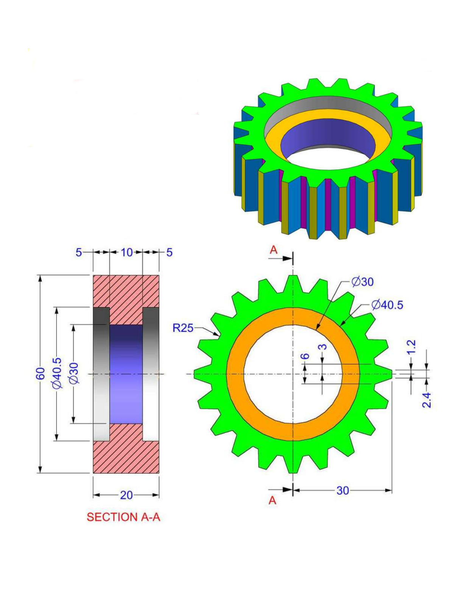
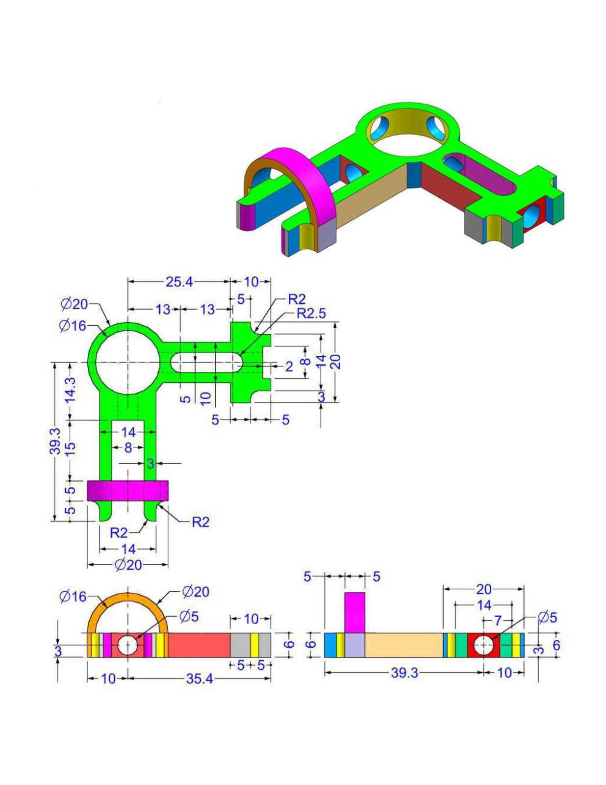
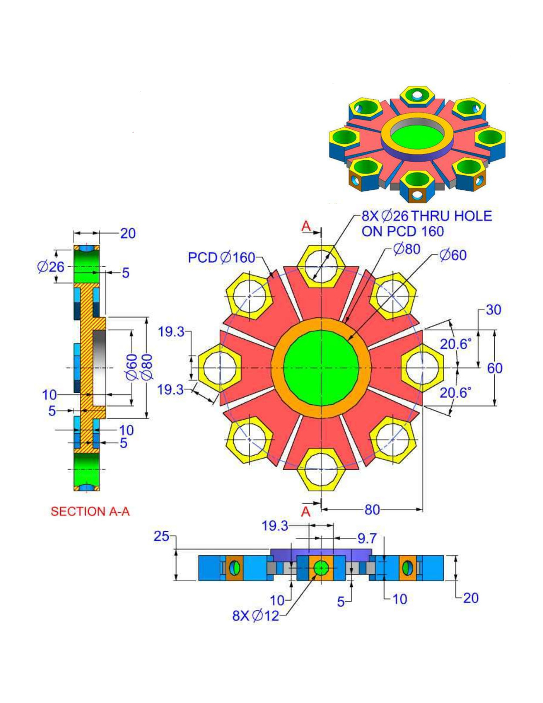
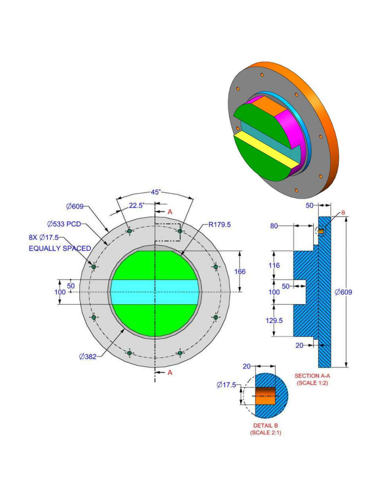
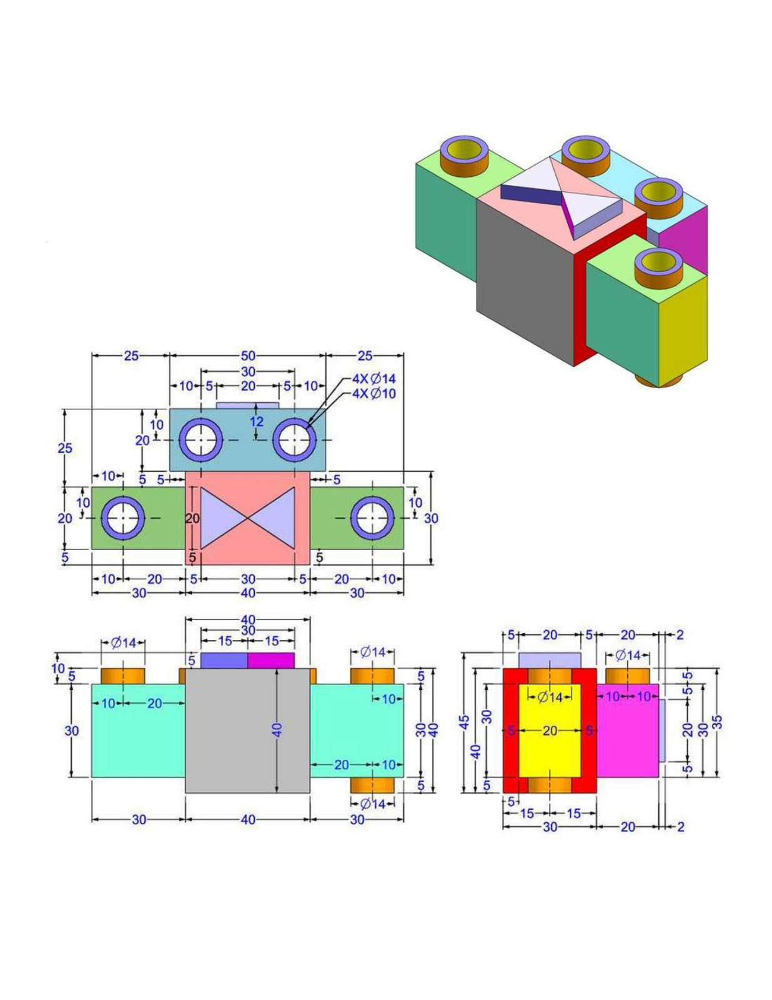
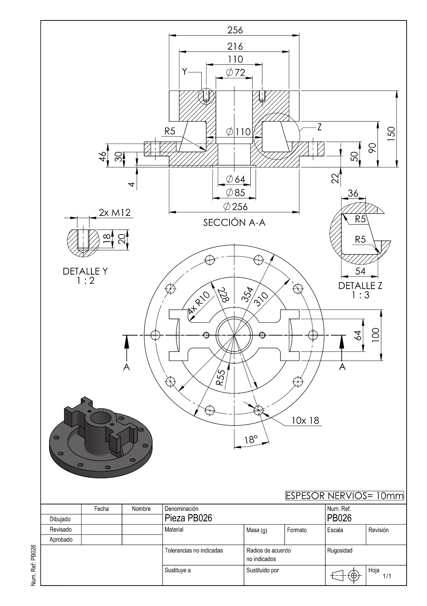
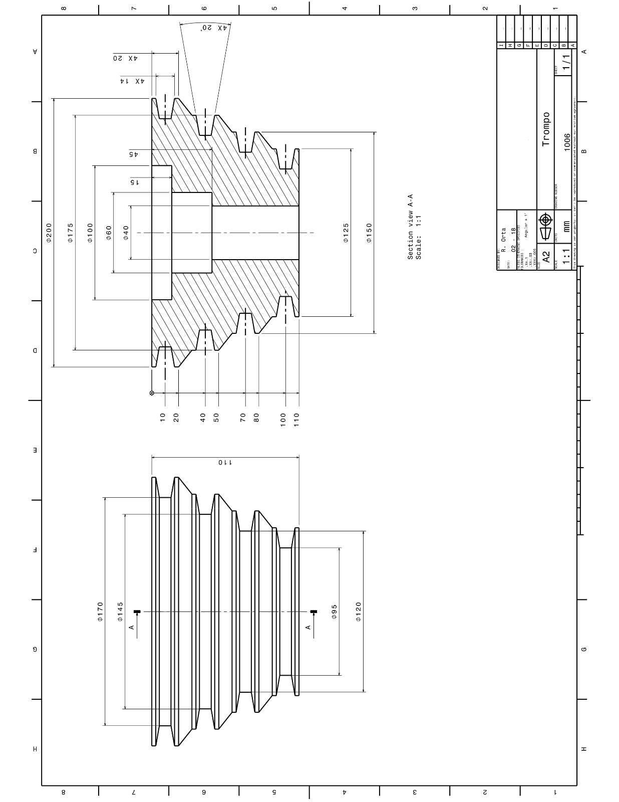

# Mechanical Modeling Challenge

Covenant is a physical system — cameras, enclosures, drone docking mechanisms, power distribution boards, and structural frames that need to survive outdoor deployment. Before any of that gets fabricated, it needs to be modeled.

This challenge has two parts. Part 1 tests your general CAD proficiency. Part 2 asks you to model a real component from our system.

You can use **SOLIDWORKS**, **Fusion 360**, **Onshape**, or any professional parametric CAD tool.

> **Recording requirement**: Your submission is only valid if you include a screen recording of yourself building the model. We want to see your process — how you approach the sketches, how you handle constraints, where you get stuck. It doesn't need to be edited or polished. A raw screen capture is fine.

---

## Part 1 — Parametric Modeling Exercise

This is a CSWP-style exercise. The goal is to build a part from engineering drawings using parametric equations, then update it through two stages and report the mass at each stage.

The drawings and full specifications are in [`assets/E8.pdf`](assets/E8.pdf).

### Stage 1 — Build the initial part

Build the part shown in the drawings using the following parameters:

| Parameter | Value |
|---|---|
| A | 213 mm |
| B | 200 mm |
| C | 170 mm |
| D | 130 mm |
| E | 41 mm |
| X | A / 3 |
| Y | B / 3 + 10 mm |
| F | Hole Wizard — Ansi Metric Counterbore, Hex Bolt ANSI B18.2.3.5M, M8 Close fit, Through Ø15 mm, Counterbore Ø30 mm × 10 mm deep, Through All |

- Unit system: MMGS (millimeter, gram, second)
- Material: Alloy Steel, density = 0.0077 g/mm³
- All holes through all unless noted otherwise
- Use linked dimensional values and equations — do not hardcode dimensions

**Report the mass of the part in grams.**

### Stage 2 — Update parameters

| Parameter | Value |
|---|---|
| A | 225 mm |
| B | 210 mm |
| C | 176 mm |
| D | 137 mm |
| E | 39 mm |

**Report the mass of the part in grams.**

### Stage 3 — Update parameters again

| Parameter | Value |
|---|---|
| A | 209 mm |
| B | 218 mm |
| C | 169 mm |
| D | 125 mm |
| E | 41 mm |

**Report the mass of the part in grams.**

---

## Part 2 — Model a Covenant Component

Covenant's drone docking station includes a **landing and retention mechanism** — the physical structure that guides an incoming drone, centers it on the platform, and holds it in place while it charges and transfers data.

The reference images below are **not components we use** — they are publicly available CAD examples included only to give you a sense of the modeling complexity and style we are looking for. The actual Covenant mechanism is still being designed, which is exactly why this challenge exists.

| Reference |
|---|
|  |
|  |
|  |
|  |
|  |
|  |
|  |

### Your task

Model **one of the following components** — your choice:

**Option A — Landing Platform Base**
A flat square platform (250 mm × 250 mm) with:
- 4× corner guide rails (L-shaped, 40 mm tall) to funnel the drone into center
- A central circular cutout (Ø80 mm) for the charging pogo pin array
- 4× M6 counterbore mounting holes at corners for attachment to the station frame
- 3 mm wall thickness throughout
- Material: 6061 Aluminum

**Option B — Winch Bracket Mount**
A structural bracket that attaches a small winch motor (60 mm × 60 mm × 80 mm envelope) to a 40×40 mm aluminum extrusion frame, with:
- A U-channel base that clamps onto the extrusion (slot width 8 mm, M5 T-nut compatible)
- A motor mounting face with 4× M4 bolt pattern (40 mm × 40 mm PCD)
- A cable guide hole (Ø12 mm) aligned to the motor output shaft
- Material: 6061 Aluminum

**Option C — Free choice**
If you have a better idea for a component that belongs in this system, model that instead and explain what it does and where it fits.

### Deliverables

1. **Screen recording** of your modeling session — required, no exceptions
2. **CAD file** — native format (.sldprt, .f3d, .step, or equivalent)
3. **STEP export** — so we can open it regardless of tool
4. **Mass and volume** — as reported by your CAD tool, with material assigned
5. **3 screenshots** — top, front, and isometric views
6. **Brief note** (a few sentences) — what assumptions you made, what you would change with more information about the real system

---

## Submission

Send everything to [eduardo@nuclea.solutions](mailto:eduardo@nuclea.solutions) with subject line `[Mechanical] Your Name`.

We review every submission and respond within a week.
